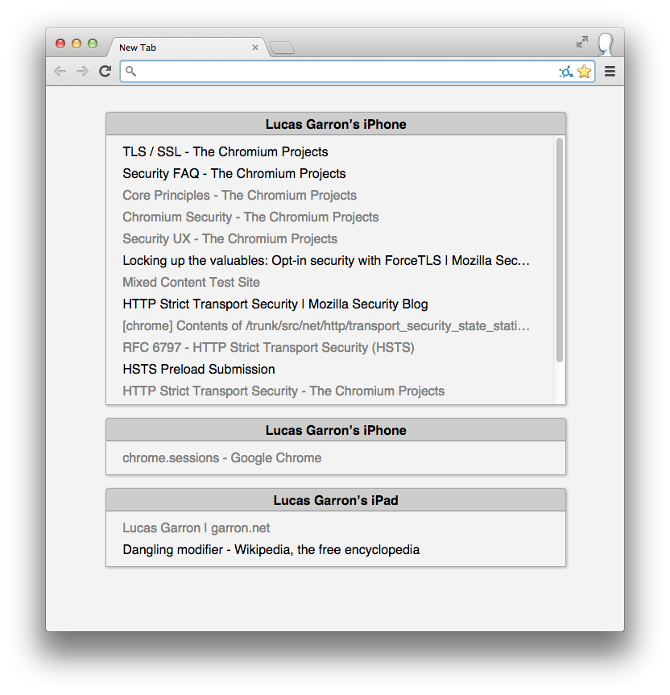

# View Devices in New Tab (Chrome Extension)

Changes the new tab page to be a list of tabs open on your other devices.

[Install from Chrome Store](https://chrome.google.com/webstore/detail/view-devices-in-new-tab/openfippajlljagenibphbbpmifdploj)

## Info

If you're signed into Chrome on multiple devices, you can use any device to view a list of tabs that are open on the others. This is easy on mobile, but it can be annoying to view it on desktop (either on the history tab, or by clicking on "Recent tabs" in the settings dropdown).

This changes the new tab page to a simple listing of your tabs on other devices.